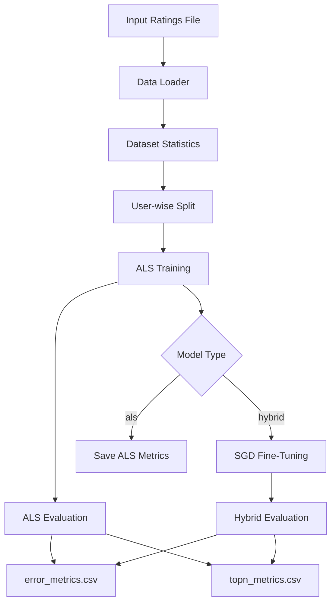

<div align="center">

# 🚀 Ranking-Oriented Hybrid Matrix Factorization

### ALS Initialization + SGD Fine-Tuning for Top-N Recommendation in C++17

<p align="center">
  
  
  
  
  
</p>

**A reproducible recommender-system project that compares ALS and Hybrid ALS → SGD training using Matrix Factorization, rating-prediction metrics, and Top-N ranking evaluation.**

</div>

---

## 📑 Table of Contents

- [📌 Description](#-description)
- [✨ Main Features](#-main-features)
- [🧱 Project Architecture](#-project-architecture)
- [📂 Folder Structure](#-folder-structure)
- [🧩 Main Files Explained](#-main-files-explained)
- [⚙️ Installation](#️-installation)
- [▶️ Execution](#️-execution)
- [🧠 Internal Workflow](#-internal-workflow)
- [🛠️ Technologies Used](#️-technologies-used)
- [📊 Metrics and Outputs](#-metrics-and-outputs)
- [🧪 Usage Examples](#-usage-examples)
- [📈 Plotting Results](#-plotting-results)
- [💡 Development Highlights](#-development-highlights)
- [🚀 Future Improvements](#-future-improvements)
- [👨‍💻 Author](#-author)

---

## 📌 Description

This project implements a **Matrix Factorization recommender system** in **C++17**. The system trains latent user and item embeddings from sparse rating data and evaluates recommendation quality using both classic prediction metrics and Top-N ranking metrics.

The core idea is to compare two training strategies:

1. **ALS baseline**: Alternating Least Squares is used to learn user and item latent factors by solving regularized least-squares systems.
2. **Hybrid ALS → SGD model**: ALS first produces a stable initialization, and then Stochastic Gradient Descent performs a short fine-tuning stage without reinitializing the embeddings.

The project is designed for experimentation with **MovieLens-style datasets**, including CSV ratings and MovieLens `.dat` files using the `::` separator.

---

## ✨ Main Features

| Feature | Description |
|---|---|
| 🧮 Matrix Factorization | Learns low-dimensional user and item latent vectors. |
| 🔁 ALS Training | Implements Alternating Least Squares with normal equations and LDLT solving. |
| ⚡ SGD Fine-Tuning | Applies SGD after ALS initialization for hybrid optimization. |
| 📊 Rating Metrics | Computes RMSE and MAE on validation/test splits. |
| 🎯 Top-N Metrics | Computes Recall@K, NDCG@K, MAP@K, coverage, and evaluated users. |
| 🧪 Dataset Splitting | Performs user-wise random train/validation/test splitting. |
| 📁 Automatic Results | Saves timestamped CSV reports for error and ranking metrics. |
| 🧰 CLI Execution | Provides command-line arguments for model, dataset, hyperparameters, and evaluation settings. |
| 🧬 Eigen Integration | Uses Eigen for dense matrix operations and linear-system solving. |
| 🖥️ Windows Build Script | Includes `build.bat` for compiling the project with `g++`. |

---

## 🧱 Project Architecture

The project follows a modular C++ architecture. Header files define the public interfaces, while source files contain the implementations. The main execution flow is controlled by `src/main.cpp`.



### High-level architecture

| Layer | Responsibility |
|---|---|
| **Input Layer** | Loads CSV or MovieLens `.dat` rating files. |
| **Data Layer** | Stores ratings using a lightweight `Rating` struct. |
| **Split Layer** | Builds train/validation/test partitions per user. |
| **Model Layer** | Trains ALS and optionally fine-tunes using SGD. |
| **Evaluation Layer** | Computes RMSE, MAE, Recall@K, NDCG@K, MAP@K, and coverage. |
| **Output Layer** | Saves metrics into timestamped CSV files under `results/`. |

---

## 📂 Folder Structure

```bash
RECSYS GPT/
├── .vscode/
│   └── settings.json
├── bin/
│   └── recsys.exe
├── include/
│   └── recsys/
│       ├── als.hpp
│       ├── io.hpp
│       ├── metrics.hpp
│       ├── sgd.hpp
│       ├── split.hpp
│       ├── types.hpp
│       └── utils.hpp
├── results/
│   ├── csv/
│   │   └── <timestamp>/
│   │       ├── error_metrics.csv
│   │       └── topn_metrics.csv
│   ├── ml1m/
│   │   └── <timestamp>/
│   │       ├── error_metrics.csv
│   │       └── topn_metrics.csv
│   └── ml10m/
│       └── <timestamp>/
│           ├── error_metrics.csv
│           └── topn_metrics.csv
├── src/
│   ├── als.cpp
│   ├── io.cpp
│   ├── main.cpp
│   ├── main .cpp
│   ├── metrics.cpp
│   ├── sgd.cpp
│   ├── split.cpp
│   └── utils.cpp
├── third_party/
│   └── eigen/
├── plots.py
└── README.md
```

> **Note about external files:** The `data/` directory is expected to contain the MovieLens dataset files for the 100K, 1M, and 10M experiments. These `.dat` files were not uploaded to the repository because they are large and should be downloaded directly from the official GroupLens website: https://grouplens.org/datasets/. After downloading the required MovieLens version, extract the files and place them inside the corresponding `data/` subfolder used by the project. Similarly, the `third_party/` directory should contain the Eigen library, which is required for linear algebra operations in the C++ implementation. To install it manually, download Eigen from https://eigen.tuxfamily.org/, extract the package, and copy the `Eigen/` folder into `third_party/eigen/`. The expected structure is `third_party/eigen/Eigen/...`. Once both the datasets and Eigen are placed in the correct folders, the project can be compiled and executed normally.

---

## 🧩 Main Files Explained

| File / Folder | Description | Role inside the Project |
|---|---|---|
| `src/main.cpp` | Main program entry point. Parses CLI arguments, loads data, splits the dataset, trains ALS, optionally applies SGD fine-tuning, evaluates metrics, and saves CSV outputs. | Central execution controller. |
| `src/main .cpp` | Duplicate-looking file with a space in the filename. | Not used by `build.bat`; likely a backup or accidental duplicate. |
| `include/recsys/types.hpp` | Defines the basic `Rating` and `DatasetStats` structures. | Shared data types across the project. |
| `src/io.cpp` / `include/recsys/io.hpp` | Implements rating loaders for CSV and MovieLens `.dat` files, dataset-stat inference, and CSV writing. | Handles input/output operations. |
| `src/split.cpp` / `include/recsys/split.hpp` | Implements user-wise train/validation/test splitting and builds item lists per user. | Prepares data for training and evaluation. |
| `src/als.cpp` / `include/recsys/als.hpp` | Implements ALS training using normal equations and Eigen LDLT decomposition. | Trains the ALS baseline and initializes the hybrid model. |
| `src/sgd.cpp` / `include/recsys/sgd.hpp` | Implements SGD training with L2 regularization. Supports `reinit=false` for fine-tuning from existing ALS factors. | Performs the SGD refinement stage in the hybrid model. |
| `src/metrics.cpp` / `include/recsys/metrics.hpp` | Computes RMSE, MAE, Recall@K, NDCG@K, MAP@K, coverage, and number of evaluated users. | Evaluation module. |
| `src/utils.cpp` / `include/recsys/utils.hpp` | Provides timestamp generation, directory creation, file-existence checks, and path joining. | Utility support for reproducible result storage. |
| `build.bat` | Windows batch script that compiles the project using `g++`, C++17, optimization flags, and Eigen include paths. | Main build script. |
| `bin/recsys.exe` | Precompiled executable included in the project. | Ready-to-run binary for Windows environments. |
| `third_party/eigen/` | Vendored Eigen headers. | Linear algebra dependency used by ALS, SGD, and metric computation. |
| `results/` | Contains timestamped CSV files from previous experimental runs. | Stores output metrics. |
| `plots.py` | Python script for visualizing Recall@10 and NDCG@10 from CSV outputs. | Optional plotting utility. |
| `.vscode/settings.json` | VS Code file-association configuration for C++ headers and standard-library files. | Development environment support. |
| `README.md` | Original README contained only the project title. | Replaced by this professional documentation. |

---

## ⚙️ Installation

### 1. Requirements

| Tool | Required? | Notes |
|---|---:|---|
| `g++` | ✅ Yes | Must support C++17. |
| Eigen | ✅ Included | Available under `third_party/eigen/`. |
| Windows CMD / PowerShell | ✅ Recommended | `build.bat` is designed for Windows. |
| Python 3 | Optional | Only needed for `plots.py`. |
| pandas | Optional | Required by `plots.py`. |
| matplotlib | Optional | Required by `plots.py`. |

### 2. Clone or extract the project

```bash
# If using Git
 git clone <your-repository-url>
 cd "RECSYS GPT"
```

Or simply extract the ZIP file and open the project folder.

### 3. Compile on Windows

The project includes a ready-to-use build script:

```bat
build.bat
```

This produces:

```bash
bin/recsys.exe
```

### 4. Manual compilation command

If you prefer compiling manually with `g++`, use:

```bash
g++ -std=c++17 -O3 -march=native -DEIGEN_NO_DEBUG \
  -I "include" -I "third_party/eigen" \
  src/main.cpp src/io.cpp src/split.cpp src/als.cpp src/sgd.cpp src/metrics.cpp src/utils.cpp \
  -o bin/recsys.exe
```

> On Linux/macOS, change the output name if desired, for example `-o bin/recsys`.

---

## ▶️ Execution

The executable requires at least a dataset path:

```bash
bin/recsys.exe --data <path-to-ratings-file>
```

### Supported CLI arguments

| Argument | Default | Description |
|---|---:|---|
| `--data` | Required | Path to the ratings file. |
| `--format` | `csv` | Input format: `csv`, `ml1m`, or `ml10m`. |
| `--model` | `hybrid` | Model mode: `als` or `hybrid`. |
| `--k` | `50` | Number of latent factors. |
| `--lambda` | `0.2` | L2 regularization coefficient. |
| `--iters` | `6` | Number of ALS iterations. |
| `--epochs_sgd` | `2` | Number of SGD fine-tuning epochs. |
| `--lr` | `0.01` | SGD learning rate. |
| `--K_top` | `10` | Top-K value for ranking evaluation. |
| `--neg_per_user` | `500` | Number of negative items sampled per user for Top-N evaluation. |
| `--seed` | `42` | Random seed for deterministic experiments. |
| `--val_ratio` | `0.1` | Validation ratio per user. |
| `--test_ratio` | `0.1` | Test ratio per user. |

---

## 🧠 Internal Workflow

The system executes the following pipeline:

1. **Read ratings**
   - CSV files are loaded using `load_csv_ratings()`.
   - MovieLens `.dat` files are loaded using `load_movielens_dat()`.

2. **Infer dataset statistics**
   - The program computes number of users, number of items, number of ratings, and matrix density.

3. **Split ratings per user**
   - `make_user_splits()` creates train, validation, and test sets using the configured ratios.

4. **Train ALS**
   - `train_als()` initializes user matrix `U` and item matrix `V`.
   - For each ALS iteration:
     - User factors are updated while item factors are fixed.
     - Item factors are updated while user factors are fixed.
   - Linear systems are solved using Eigen's `LDLT` decomposition.

5. **Evaluate ALS**
   - RMSE and MAE are computed on the test split.
   - Top-N metrics are computed using sampled negative candidates.

6. **Optional hybrid stage**
   - If `--model hybrid` is selected, the program calls `train_sgd()` with `reinit=false`.
   - This means SGD starts from the ALS-trained embeddings instead of random vectors.

7. **Evaluate Hybrid model**
   - The fine-tuned embeddings are evaluated again using the same metrics.

8. **Save results**
   - Results are written into timestamped CSV files under `results/<dataset>/<timestamp>/`.

---

## 🛠️ Technologies Used

| Technology | Purpose |
|---|---|
| **C++17** | Main implementation language. |
| **Eigen** | Dense matrix and vector operations, including LDLT linear solving. |
| **g++** | Compiler used by the provided build script. |
| **Python** | Optional visualization through `plots.py`. |
| **pandas** | CSV loading for plotting. |
| **matplotlib** | Bar-chart visualization of ranking metrics. |
| **VS Code** | Development support through `.vscode/settings.json`. |

---

## 📊 Metrics and Outputs

### Rating-prediction metrics

| Metric | Meaning |
|---|---|
| **RMSE** | Root Mean Squared Error between true and predicted ratings. Lower is better. |
| **MAE** | Mean Absolute Error between true and predicted ratings. Lower is better. |

### Top-N recommendation metrics

| Metric | Meaning |
|---|---|
| **Recall@K** | Measures how many relevant test items appear in the Top-K recommendation list. Higher is better. |
| **NDCG@K** | Measures ranking quality with position-based discounting. Higher is better. |
| **MAP@K** | Measures precision at ranks where relevant items appear. Higher is better. |
| **Coverage** | Fraction of the item catalog that appears in at least one recommendation list. Higher can indicate broader catalog exposure. |

### Output files

Every run creates a timestamped folder like:

```bash
results/ml1m/2025-10-18_20-36-22/
├── error_metrics.csv
└── topn_metrics.csv
```

`error_metrics.csv` contains:

```csv
model,split,rmse,mae
ALS,TEST,...,...
HYBRID,TEST,...,...
```

`topn_metrics.csv` contains:

```csv
model,split,K,recall,ndcg,map,coverage,users_evaluated,neg_per_user
ALS,TEST,10,...,...,...,...,...,500
HYBRID,TEST,10,...,...,...,...,...,500
```

---

## 🧪 Usage Examples

### Example 1: Run Hybrid ALS → SGD on a CSV dataset

```bash
bin/recsys.exe \
  --data data/ratings.csv \
  --format csv \
  --model hybrid \
  --k 50 \
  --lambda 0.2 \
  --iters 6 \
  --epochs_sgd 2 \
  --lr 0.01 \
  --K_top 10 \
  --neg_per_user 500 \
  --seed 42
```

### Example 2: Run only ALS on MovieLens 1M

```bash
bin/recsys.exe \
  --data data/ml-1m/ratings.dat \
  --format ml1m \
  --model als \
  --k 50 \
  --lambda 0.2 \
  --iters 6 \
  --K_top 10
```

### Example 3: Run Hybrid model on MovieLens 10M

```bash
bin/recsys.exe \
  --data data/ml-10m/ratings.dat \
  --format ml10m \
  --model hybrid \
  --k 50 \
  --lambda 0.2 \
  --iters 6 \
  --epochs_sgd 2 \
  --lr 0.01 \
  --K_top 10 \
  --neg_per_user 500
```

> Dataset files are **not included** in the analyzed ZIP. The project expects the user to provide the rating files manually.

---

## 📈 Plotting Results

The repository includes a Python plotting script:

```bash
plots.py
```

It loads a `topn_metrics.csv` file and creates bar charts for:

- Recall@10
- NDCG@10

Install the optional Python dependencies:

```bash
pip install pandas matplotlib
```

Run:

```bash
python plots.py
```

> Important: the script currently contains a hardcoded path: `results/ml100k/topn_metrics.csv`. In the provided project structure, generated results are stored inside timestamped folders such as `results/csv/<timestamp>/topn_metrics.csv`, `results/ml1m/<timestamp>/topn_metrics.csv`, or `results/ml10m/<timestamp>/topn_metrics.csv`. Update the path in `plots.py` before running it.

---

## 💡 Development Highlights

- The implementation is intentionally lightweight and readable.
- ALS and SGD are separated into independent modules.
- The hybrid model reuses ALS factors as the initialization for SGD.
- Evaluation includes both error-based and ranking-based metrics.
- Results are automatically saved with timestamps for experiment tracking.
- Eigen is included locally, so no separate Eigen installation is required.
- The CLI makes it easy to test different datasets, seeds, latent dimensions, and model configurations.

---

## 🚀 Future Improvements

| Improvement | Motivation |
|---|---|
| Add CMake support | Make the project easier to compile across Windows, Linux, and macOS. |
| Remove duplicate `src/main .cpp` | Avoid confusion caused by duplicate entry-point files. |
| Add bias terms | Improve rating prediction by modeling global, user, and item biases. |
| Add OpenMP parallelism | Speed up ALS user/item updates, which are naturally parallelizable. |
| Add full-ranking evaluation | Current Top-N evaluation uses negative sampling per user. Full ranking would evaluate all candidate items. |
| Add BPR or pairwise ranking loss | Better align training with Top-N recommendation objectives. |
| Add configuration files | Store experiment settings in JSON/YAML instead of long CLI commands. |
| Improve plotting script | Automatically locate latest result folders and generate publication-ready charts. |
| Add unit tests | Validate loaders, split generation, metrics, and model updates. |
| Add LICENSE file | The current project does not specify a license. |

---

## 👨‍💻 Author

**Name:** `<Andres Alexander Basantes Balcazar>`  
**Project:** Ranking-Oriented Hybrid Matrix Factorization  
**Area:** Recommender Systems, Matrix Factorization, Algorithm Analysis  
**Institution:** Not specified in the project files  
**License:** Not specified in the project files

---

<div align="center">

### ⭐ If this project is useful for your academic work or portfolio, consider documenting experiments and publishing reproducible results.

</div>
