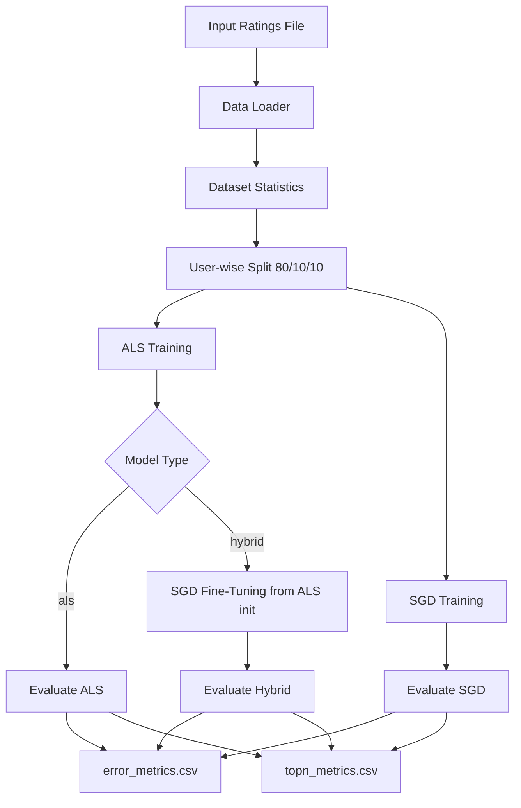

<div align="center">

# Accuracy and Ranking Trade-Offs in Hybrid ALS–SGD Matrix Factorization

### ALS Initialization + SGD Fine-Tuning for Top-N Recommendation in C++17

<p align="center">
  
  
  
  
  
</p>

**A reproducible recommender-system study comparing ALS, SGD, and a Hybrid ALS→SGD training strategy using Matrix Factorization on MovieLens 1M and 10M, evaluated on both rating-prediction and Top-N ranking metrics.**

</div>

---

## 📑 Table of Contents

- [📌 Description](#-description)
- [✨ Main Features](#-main-features)
- [🧱 Project Architecture](#-project-architecture)
- [📂 Folder Structure](#-folder-structure)
- [🧩 Main Files Explained](#-main-files-explained)
- [⚙️ Installation](#️-installation)
- [▶️ Execution](#️-execution)
- [🧠 Internal Workflow](#-internal-workflow)
- [🛠️ Technologies Used](#️-technologies-used)
- [📊 Experimental Results](#-experimental-results)
- [🧪 Usage Examples](#-usage-examples)
- [📈 Plotting Results](#-plotting-results)
- [💡 Development Highlights](#-development-highlights)
- [🚀 Future Improvements](#-future-improvements)

---

## 📌 Description

This repository accompanies the paper **"Accuracy and Ranking Trade-Offs in Hybrid ALS–SGD Matrix Factorization"** submitted to TICEC 2026 (Scientific Track, AI and Data Science axis).

The project implements a **Matrix Factorization recommender system** in **C++17** and compares three training strategies:

1. **ALS baseline** — Alternating Least Squares solves regularized least-squares systems block by block to learn user and item latent factors.
2. **SGD baseline** — Stochastic Gradient Descent processes individual ratings with low per-step cost. Included as an explicit baseline for both rating-prediction and ranking metrics.
3. **Hybrid ALS → SGD** — ALS runs first to produce a stable initialization; SGD then fine-tunes the same factors for a small number of additional epochs using the same squared-error objective.

The key empirical finding is that **SGD achieves the best Top-N ranking metrics** on both MovieLens 1M and 10M, while **ALS achieves the lowest MAE on ML-10M**. The hybrid does not outperform standalone SGD on any metric and incurs 24–49% additional training time relative to ALS alone. These results are discussed in detail in the paper.

> **Note:** The SGD fine-tuning stage minimizes the same squared rating-error loss as ALS. It is not a ranking-oriented or pairwise objective. The ranking differences observed between methods arise from optimization dynamics, not from a different training loss.

---

## ✨ Main Features

| Feature | Description |
|---|---|
| 🧮 Matrix Factorization | Learns low-dimensional user and item latent vectors (bias-free formulation). |
| 🔁 ALS Training | Alternating Least Squares with normal equations solved via Eigen LDLT. |
| ⚡ SGD Training | Standalone SGD baseline and hybrid fine-tuning from ALS initialization (`reinit=false`). |
| 📊 Rating Metrics | RMSE and MAE on the held-out test split. |
| 🎯 Top-N Metrics | Recall@K, NDCG@K, MAP@K using sampled negative evaluation (500 negatives per user). |
| 🧪 Dataset Splitting | User-wise 80/10/10 train/validation/test split with fixed seed. |
| 📁 Automatic Results | Timestamped CSV reports for error and ranking metrics saved under `results/`. |
| 🧰 CLI Execution | Command-line arguments for model, dataset, hyperparameters, and evaluation settings. |
| 🧬 Eigen Integration | Dense matrix operations and linear-system solving via Eigen 3.4. |
| 🖥️ Windows Build Script | `build.bat` for compilation with `g++`. |

---

## 🧱 Project Architecture



### High-level architecture

| Layer | Responsibility |
|---|---|
| **Input Layer** | Loads CSV or MovieLens `.dat` rating files. |
| **Data Layer** | Stores ratings using a lightweight `Rating` struct. |
| **Split Layer** | Builds train/validation/test partitions per user (seed = 42). |
| **Model Layer** | Trains ALS, standalone SGD, and optionally the hybrid (ALS → SGD). |
| **Evaluation Layer** | Computes RMSE, MAE, Recall@K, NDCG@K, MAP@K, coverage (500 sampled negatives per user). |
| **Output Layer** | Saves metrics into timestamped CSV files under `results/`. |

---

## 📂 Folder Structure

```bash
RECSYS GPT/
├── .vscode/
│   └── settings.json
├── bin/
│   └── recsys.exe
├── include/
│   └── recsys/
│       ├── als.hpp
│       ├── io.hpp
│       ├── metrics.hpp
│       ├── sgd.hpp
│       ├── split.hpp
│       ├── types.hpp
│       └── utils.hpp
├── results/
│   ├── ml1m/
│   │   └── <timestamp>/
│   │       ├── error_metrics.csv
│   │       └── topn_metrics.csv
│   └── ml10m/
│       └── <timestamp>/
│           ├── error_metrics.csv
│           └── topn_metrics.csv
├── src/
│   ├── als.cpp
│   ├── io.cpp
│   ├── main.cpp
│   ├── metrics.cpp
│   ├── sgd.cpp
│   ├── split.cpp
│   └── utils.cpp
├── third_party/
│   └── eigen/
├── plots.py
└── README.md
```

> **External dependencies:** The `data/` directory should contain the MovieLens `.dat` files, available at [https://grouplens.org/datasets/movielens/](https://grouplens.org/datasets/movielens/). The `third_party/` directory should contain the Eigen library, available at [https://eigen.tuxfamily.org/](https://eigen.tuxfamily.org/). Extract the `Eigen/` folder into `third_party/eigen/` so the expected path is `third_party/eigen/Eigen/...`.

---

## 🧩 Main Files Explained

| File / Folder | Description | Role |
|---|---|---|
| `src/main.cpp` | Entry point. Parses CLI arguments, loads data, splits the dataset, trains the selected model(s), evaluates metrics, and saves CSV outputs. | Central execution controller. |
| `include/recsys/types.hpp` | Defines `Rating` and `DatasetStats` structures. | Shared data types. |
| `src/io.cpp` / `include/recsys/io.hpp` | Rating loaders for CSV and MovieLens `.dat` files, dataset-stat inference, and CSV writing. | Input/output operations. |
| `src/split.cpp` / `include/recsys/split.hpp` | User-wise train/validation/test splitting and per-user item lists. | Data preparation. |
| `src/als.cpp` / `include/recsys/als.hpp` | ALS training using normal equations and Eigen LDLT decomposition. | ALS baseline and hybrid initialization. |
| `src/sgd.cpp` / `include/recsys/sgd.hpp` | SGD training with L2 regularization. Supports `reinit=false` to fine-tune from existing ALS factors. | SGD baseline and hybrid fine-tuning stage. |
| `src/metrics.cpp` / `include/recsys/metrics.hpp` | Computes RMSE, MAE, Recall@K, NDCG@K, MAP@K, coverage, and evaluated users. Ranking uses 500 sampled negatives per user. | Evaluation module. |
| `src/utils.cpp` / `include/recsys/utils.hpp` | Timestamp generation, directory creation, file-existence checks, path joining. | Utility support. |
| `build.bat` | Compiles the project with `g++`, C++17 flags, and Eigen include paths. | Main build script (Windows). |
| `bin/recsys.exe` | Precompiled executable for Windows. | Ready-to-run binary. |
| `third_party/eigen/` | Vendored Eigen headers. | Linear algebra dependency. |
| `results/` | Timestamped CSV files from experimental runs. Results for ML-1M and ML-10M are included. | Output storage. |
| `plots.py` | Python script for visualizing RMSE, MAE, Recall@10, and NDCG@10 from CSV outputs. | Optional plotting utility. |

---

## ⚙️ Installation

### Requirements

| Tool | Required? | Notes |
|---|---|---|
| `g++` | ✅ Yes | Must support C++17. |
| Eigen 3.4 | ✅ Included | Under `third_party/eigen/`. |
| Windows CMD / PowerShell | ✅ Recommended | `build.bat` targets Windows. |
| Python 3 | Optional | Only needed for `plots.py`. |
| pandas | Optional | Required by `plots.py`. |
| matplotlib | Optional | Required by `plots.py`. |

### Compilation

Using the provided build script (Windows):

```bash
build.bat
```

Or manually with `g++`:

```bash
g++ -std=c++17 -O3 -Iinclude -Ithird_party/eigen \
    src/main.cpp src/als.cpp src/sgd.cpp src/io.cpp \
    src/metrics.cpp src/split.cpp src/utils.cpp \
    -o bin/recsys
```

---

## ▶️ Execution

### Supported CLI Arguments

| Argument | Default | Description |
|---|---|---|
| `--data` | Required | Path to the ratings file. |
| `--format` | `csv` | Input format: `csv`, `ml1m`, or `ml10m`. |
| `--model` | `hybrid` | Model mode: `als`, `sgd`, or `hybrid`. |
| `--k` | `50` | Number of latent factors. |
| `--lambda` | `0.2` | L2 regularization coefficient. |
| `--iters` | `6` | Number of ALS iterations. |
| `--epochs_sgd` | `2` | Number of SGD fine-tuning epochs (hybrid) or training epochs (standalone SGD). |
| `--lr` | `0.01` | SGD learning rate. |
| `--K_top` | `10` | Top-K value for ranking evaluation. |
| `--neg_per_user` | `500` | Number of negative items sampled per user for Top-N evaluation. |
| `--seed` | `42` | Random seed for reproducibility. |
| `--val_ratio` | `0.1` | Validation ratio per user. |
| `--test_ratio` | `0.1` | Test ratio per user. |

---

## 🧠 Internal Workflow

1. **Load ratings** — CSV via `load_csv_ratings()` or MovieLens `.dat` via `load_movielens_dat()`.
2. **Infer dataset statistics** — number of users, items, ratings, and matrix density.
3. **Split per user** — `make_user_splits()` builds train/validation/test sets (80/10/10, seed = 42). Users with fewer than 5 ratings are excluded.
4. **Train ALS** — `train_als()` initializes `U` and `V`, then alternates block updates solved with Eigen LDLT. Stops at convergence or `--iters` iterations.
5. **Train standalone SGD** (if `--model sgd`) — `train_sgd()` with `reinit=true` starts from random factors and runs for `--epochs_sgd` epochs.
6. **Hybrid fine-tuning** (if `--model hybrid`) — `train_sgd()` with `reinit=false` starts from the ALS factors and runs a small number of SGD epochs.
7. **Evaluate** — RMSE and MAE on the test split; Recall@K, NDCG@K, MAP@K using 500 sampled negatives per user (training items excluded; users without positive test items excluded from ranking evaluation; relevance threshold: rating ≥ 4).
8. **Save results** — Metrics written to `results/<dataset>/<timestamp>/error_metrics.csv` and `topn_metrics.csv`.

---

## 🛠️ Technologies Used

| Technology | Purpose |
|---|---|
| **C++17** | Main implementation language. |
| **Eigen 3.4** | Dense matrix and vector operations, LDLT linear-system solving. |
| **g++ / GCC 12.2** | Compiler (`-O3` optimization). |
| **OpenMP** | Parallelism for ALS user/item updates. |
| **Python 3** | Optional visualization via `plots.py`. |
| **pandas** | CSV loading for plotting. |
| **matplotlib** | Bar-chart generation. |

---

## 📊 Experimental Results

All results are produced with seed = 42, latent dimension $d = 50$, $\lambda = 0.2$, 6 ALS iterations, and 2 SGD fine-tuning epochs (hybrid) or 20 SGD epochs (standalone). Ranking evaluation uses 500 sampled negatives per user and $K = 10$.

### Rating-Prediction Accuracy (lower is better)

| Dataset | ALS RMSE | ALS MAE | SGD RMSE | SGD MAE | Hybrid RMSE | Hybrid MAE |
|---|---|---|---|---|---|---|
| ML-1M  | 1.133 | 0.860 | **0.978** | **0.785** | 1.048 | 0.836 |
| ML-10M | 0.942 | **0.710** | **0.926** | 0.733 | 0.928 | 0.732 |

### Top-N Ranking Quality — Recall@10 / NDCG@10 / MAP@10 (higher is better)

| Dataset | ALS | SGD | Hybrid |
|---|---|---|---|
| ML-1M  | 0.037 / 0.029 / 0.009 | **0.143 / 0.136 / 0.067** | 0.071 / 0.070 / 0.037 |
| ML-10M | 0.188 / 0.139 / 0.067 | **0.383 / 0.361 / 0.237** | 0.106 / 0.098 / 0.067 |

### Training Time (seconds, evaluation excluded)

| Dataset | ALS | SGD | Hybrid | Overhead vs. ALS |
|---|---|---|---|---|
| ML-1M  | 6.20  | 0.60  | 7.71   | +24.3% |
| ML-10M | 76.23 | 25.63 | 113.64 | +49.0% |

**Key takeaway:** SGD is the best choice when Top-N ranking is the primary goal. ALS is the best choice when MAE on large datasets is the priority. The hybrid does not outperform standalone SGD on any metric and adds overhead relative to ALS.

---

## 🧪 Usage Examples

### Run standalone SGD on MovieLens 1M

```bash
bin/recsys.exe \
  --data data/ml-1m/ratings.dat \
  --format ml1m \
  --model sgd \
  --k 50 \
  --lambda 0.2 \
  --epochs_sgd 20 \
  --lr 0.01 \
  --K_top 10 \
  --neg_per_user 500 \
  --seed 42
```

### Run ALS baseline on MovieLens 10M

```bash
bin/recsys.exe \
  --data data/ml-10m/ratings.dat \
  --format ml10m \
  --model als \
  --k 50 \
  --lambda 0.2 \
  --iters 6 \
  --K_top 10 \
  --neg_per_user 500 \
  --seed 42
```

### Run Hybrid ALS → SGD on MovieLens 10M

```bash
bin/recsys.exe \
  --data data/ml-10m/ratings.dat \
  --format ml10m \
  --model hybrid \
  --k 50 \
  --lambda 0.2 \
  --iters 6 \
  --epochs_sgd 2 \
  --lr 0.01 \
  --K_top 10 \
  --neg_per_user 500 \
  --seed 42
```

---

## 📈 Plotting Results

```bash
pip install pandas matplotlib
python plots.py
```

The script loads `topn_metrics.csv` and `error_metrics.csv` from the results folder and generates bar charts for RMSE, MAE, Recall@10, and NDCG@10. Update the path inside `plots.py` to point to the desired timestamped folder before running.

---

## 💡 Development Highlights

- ALS and SGD are implemented in independent modules; the hybrid reuses ALS factors as the SGD starting point via `reinit=false`.
- All three methods (ALS, SGD, Hybrid) are evaluated using the same protocol: 80/10/10 split, seed = 42, 500 sampled negatives, relevance threshold ≥ 4.
- Training time is measured from factor initialization to the end of the last training step; evaluation time is excluded and reported separately.
- Results are saved with timestamps to prevent overwriting across runs.
- Eigen is vendored locally; no separate installation is needed.

---

## 🚀 Future Improvements

| Improvement | Motivation |
|---|---|
| Add BPR or pairwise ranking loss | Better align SGD training with Top-N recommendation objectives; the current squared-loss SGD is not a ranking-oriented objective. |
| Add CMake support | Cross-platform compilation (Linux, macOS, Windows). |
| Full-ranking evaluation | Current Top-N evaluation uses 500 sampled negatives; full ranking would remove approximation bias. |
| Implicit feedback support | Weighted ALS (confidence-based) for datasets without explicit ratings. |
| Adaptive optimizers (Adam, AdaError) | Faster convergence and potentially better generalization for the fine-tuning stage. |
| Statistical significance testing | Paired tests across multiple seeds to validate reported differences. |
| Configuration files (JSON/YAML) | Replace long CLI commands with reproducible config files. |
| Unit tests | Validate loaders, split generation, metric computation, and model updates. |
| Add LICENSE file | The project does not currently specify a license. |

---

## 📄 Reference

If you use this code or results, please cite the accompanying paper:

```
Anonymous Author(s). Accuracy and Ranking Trade-Offs in Hybrid ALS–SGD
Matrix Factorization. TICEC 2026, Scientific Track (under review).
```

Dataset files are the standard public releases of MovieLens, available at [https://grouplens.org/datasets/movielens/](https://grouplens.org/datasets/movielens/).
